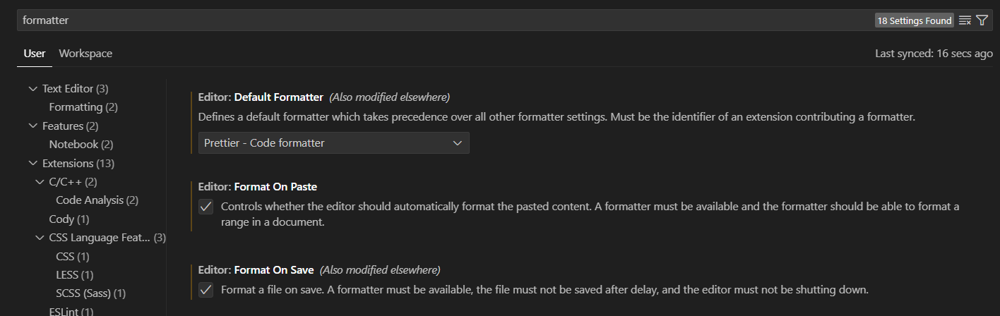
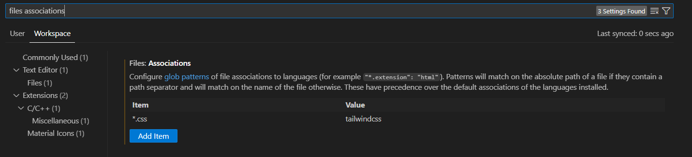

# COMPSCI 732 / SOFTENG 750 project - Team Lively Lions

# Purrlock Holmes' Cryptography Agency

> This is a MERN stack web game where you are Purrlock Holmes attempting to solve multiple ciphers and mysteries. The game is designed to be educational and fun, with a focus on teaching the player about cryptography and ciphers. The game is designed to be played in a web browser, and is designed to be played on a desktop or laptop computer with a large fixed aspect ratio.

The live deployment can be found at: https://project-group-lively-lions.onrender.com/

## Features

## Getting Started

1. Make sure you have the latest version of git, pnpm (>=8.15.1), node (>=20.11.0) installed.
2. Clone the repository (`git clone https://github.com/UOA-CS732-SE750-Students-2024/project-group-lively-lions.git`) into your preferred folder
3. `cd project-group-lively-lions` then run `pnpm install` to install the dependencies.
4. Run `pnpm run dev` to start a local development server on your machine.
5. Open your browser and navigate to local host to see the game in action.

### Other commands

- Alt + Shift + F should format the code in the current file according to Prettier + ESLint rules, otherwise you can also run `pnpm run format` to format all files.
- Running `pnpm run build` produces an application bundle that is suitable to be served over a static hosting service in `./dist`. Subsequently, running `pnpm run preview` will boot up a local server with the application bundle in `./dist`.

### Want to contribute?

We prefer VS Code. If you are using VS Code, you can use the following extensions to make your life easier:

- Prettier - Code formatter
- ESLint
- Tailwind CSS IntelliSense
- Github Copilot.
  (Optional) Change the corresponding VSCode settings:
  
  

### Meet the team!

- Jessica Lowe
- Samhar Aeron
- Rebecca Hunt
- Caleb Wei
- Peter Strobel
- Matthew Stevens

